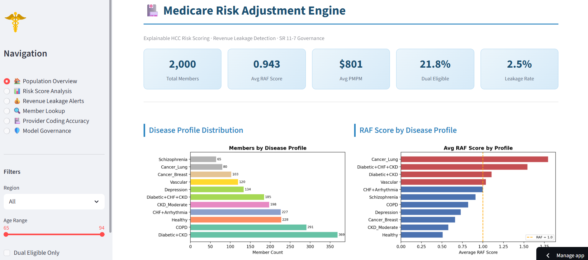

# 🏥 Explainable Medicare Risk Adjustment Engine

> **Medicare HCC Risk Scoring · Revenue Leakage Detection · SR 11-7 Model Governance**

[](https://python.org)
[](https://streamlit.io)
[](https://xgboost.ai)
[](https://shap.readthedocs.io)
[](LICENSE)
[](https://explainable-medicare-risk-engine.streamlit.app)

---

## 🖥️ Dashboard Preview



---

## 📌 Overview

This project builds an end-to-end **Medicare Risk Adjustment analytics framework** that supports health plan operations in three critical areas:

1. **RAF Score Prediction** — Machine learning models predict member Risk Adjustment Factor (RAF) scores from HCC diagnosis codes and demographics
2. **Revenue Leakage Detection** — Automated identification of members with suspected missing chronic condition codes, with estimated PMPM and annual revenue impact
3. **Model Governance** — SR 11-7 aligned documentation including bias checks, cross-validation stability, residual analysis, and audit-ready reporting

The framework is designed to reflect real-world health plan analytics workflows — gathering data from multiple sources, applying statistical modeling, generating business insights, and supporting CMS regulatory reporting.

---

## 🎯 Business Problem

Medicare Advantage health plans receive risk-adjusted payments from CMS based on member **RAF scores**. These scores are calculated from submitted diagnosis codes (HCCs). When chronic conditions present in prior years are not re-coded in the current year:

- RAF scores drop
- Monthly premium payments (PMPM) decrease
- The plan loses revenue it is entitled to receive

**This framework automates the detection of these coding gaps** — flagging high-priority members, estimating financial impact, and generating provider-level coding accuracy scores.

---

## 🏗️ Project Structure

```
explainable-medicare-risk-engine/
│
├── data/
│   ├── raw/                        # CMS HCC reference data
│   ├── processed/                  # Cleaned datasets
│   └── synthetic/
│       └── medicare_members.csv    # 2,000-member synthetic population
│
├── src/
│   ├── pipeline/
│   │   ├── hcc_reference.py        # CMS HCC v24 categories, ICD-10 mappings, RAF weights
│   │   └── generate_members.py     # Synthetic Medicare member data generator
│   ├── modeling/
│   │   └── train_models.py         # Linear Regression vs XGBoost + SHAP
│   ├── leakage/
│   │   └── leakage_engine.py       # Revenue leakage detection + PMPM impact
│   └── governance/
│       └── model_governance.py     # SR 11-7 bias checks, CV stability, residuals
│
├── dashboard/
│   └── app.py                      # Streamlit multi-page dashboard
│
├── outputs/
│   ├── models/
│   │   └── xgboost_raf_model.pkl   # Trained XGBoost model
│   ├── shap/                       # SHAP plots, governance visuals
│   └── reports/                    # CSV reports (leakage, bias, model comparison)
│
├── requirements.txt
└── README.md
```

---

## 🔬 Technical Components

### 1. Data Pipeline

- **HCC Reference Data** — CMS Medicare Advantage HCC v24 model: 40+ condition categories, ICD-10 diagnosis code mappings, RAF weight table
- **Synthetic Member Population** — 2,000 Medicare Advantage members with realistic demographics, disease profiles, dual eligibility, and intentional coding gap scenarios
- **Features** — Age, gender, dual eligibility, region, HCC count, condition flags (Diabetes, CHF, CKD, COPD, Cancer, Mental Health), interaction terms

### 2. Risk Score Modeling

| Model | R² (Test) | RMSE | Overfit Gap |
|-------|-----------|------|-------------|
| Linear Regression | **0.754** | 0.185 | 0.019 |
| Ridge Regression | 0.752 | 0.186 | 0.021 |
| XGBoost | 0.716 | 0.199 | **0.203** |

**Key finding:** RAF score calculation is inherently rule-based and additive by CMS design. Linear models capture this structure well. XGBoost's larger overfit gap (0.20) demonstrates that model complexity must be justified — not assumed. This insight directly aligns with **SR 11-7 model selection principles**.

### 3. Explainability (SHAP)

- SHAP TreeExplainer on XGBoost model
- Global feature importance — top drivers of RAF score variation
- Individual waterfall plots — member-level score decomposition
- Key contributors: HCC Count, CHF, Diabetes × CKD interaction, Age Band

### 4. Revenue Leakage Detection Engine

Compares prior year HCC codes vs current year. For each member with a chronic condition gap:

- **Suspected missing HCC** identified
- **RAF delta** calculated (prior RAF − current RAF)
- **PMPM revenue loss** estimated (RAF delta × $850 base rate)
- **Annual leakage** projected (PMPM × 12)
- **Priority tier** assigned (High / Medium / Low)
- **Coding alert** generated with specific ICD-10 suggestion

**Sample output:**
```
Member: MBR100125 | Age: 67 | Region: West
RAF: 0.832 → 0.501 (Δ 0.331)
PMPM Loss: $281.35 | Annual: $3,376.20
Alert: HCC 85 (Congestive Heart Failure) — suggest coding I50.xx
```

### 5. Model Governance (SR 11-7)

| Check | Result |
|-------|--------|
| CV Stability (5-Fold) | ✅ STABLE — R² 0.708 ± 0.040 |
| Bias / Fairness | ✅ No disparate impact (Gender, Age, Dual) |
| Residual Analysis | ⚠️ Non-normal — documented (expected in RAF models) |
| Explainability | ✅ SHAP full feature attribution |
| Audit Readiness | ✅ Documentation complete |

### 6. Streamlit Dashboard

Six interactive pages:

| Page | Description |
|------|-------------|
| 🏠 Population Overview | KPIs, disease profile distribution, RAF histogram |
| 📊 Risk Score Analysis | RAF by region/age, top-10 high-risk members, SHAP plots |
| 💰 Revenue Leakage Alerts | Flagged members, priority tiers, coding gap alerts |
| 🔍 Member Lookup | Individual member RAF breakdown and coding recommendations |
| 🏥 Provider Coding Accuracy | Region-level accuracy scores and annual leakage estimates |
| 🛡️ Model Governance | SR 11-7 checklist, model limitations, validation roadmap |

---

## 🚀 Quick Start

### Prerequisites

```bash
pip install -r requirements.txt
```

### Run Pipeline

```bash
# Step 1: Generate synthetic member data
python src/pipeline/generate_members.py

# Step 2: Train models + generate SHAP plots
python src/modeling/train_models.py

# Step 3: Run leakage detection engine
python src/leakage/leakage_engine.py

# Step 4: Run governance checks
python src/governance/model_governance.py

# Step 5: Launch dashboard
streamlit run dashboard/app.py
```

---

## 📦 Requirements

```
pandas>=2.0
numpy>=1.24
scikit-learn>=1.3
xgboost>=2.0
shap>=0.44
streamlit>=1.28
matplotlib>=3.7
scipy>=1.11
```

---

## 📊 Key Results

- **2,000** synthetic Medicare Advantage members modeled
- **38 members** flagged with coding gaps (1.9% of population)
- **$9,950/month** estimated PMPM leakage detected
- **$119,401/year** estimated annual revenue leakage
- **Southeast** region: highest leakage ($31,436/year)
- **CHF Not Coded**: most impactful scenario ($281 PMPM per member)

---

## 🔗 Related Projects

| Project | Description |
|---------|-------------|
| [Explainable Credit Risk Engine](https://github.com/Alikkiziltoprak/explainable-credit-risk-engine) | XAI-powered credit risk scoring with SHAP |
| [Fraud Detection XAI & SR 11-7](https://github.com/Alikkiziltoprak/fraud-detection-xai-sr11-7-validation) | Fraud detection with model validation framework |
| [Cement ESG Optimization](https://github.com/Alikkiziltoprak/cement-esg-optimization) | EU ETS carbon cost optimization with Streamlit |

---

## ⚠️ Disclaimer

This project uses **synthetic data** generated for educational and portfolio purposes. It does not use real patient data and is not intended for clinical or operational use. All HCC weights and RAF calculations are simplified approximations of CMS methodologies.

---

## 👤 Author

**Ali Kemal Kızıltoprak**
MS Data Science · University of Pittsburgh
16+ years Finance, Risk Management & Analytics
[GitHub](https://github.com/Alikkiziltoprak) · [LinkedIn](https://linkedin.com/in/alikkiziltoprak)
